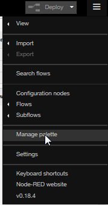
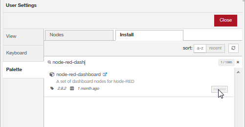

Copyright Orange - 2019 - Attribution-ShareAlike 3.0 Unported (CC BY-SA 3.0) - https://creativecommons.org/licenses/by-sa/3.0/

On Windows to install Node-Red and dashboard module you can follow that video 
<a href="https://www.youtube.com/watch?v=hEpeobDyj8k" target="_new">https://www.youtube.com/watch?v=hEpeobDyj8k</a>

<ul>
<li>go to <a href="https://nodejs.org/en/" target="_blank">https://nodejs.org/en/</a> and install Node-RED</li>
<li>on Windows, open CMD.exe as an administrator</li>
<li>install Node-RED
<code>npm install -g --unsafe-perm node-red</code></li>
<li>launch Node-RED
<code>node-red</code></li>
</ul>

You will find Note-RED at <a href="http://localhost:1880" target="_blank">http://localhost:1880</a>

To install dashboard module, open the menu at the top right and open "Manage palette" menu

then open "Install" tab , search "node-red-dashboard" and install it

You will find Dashboard at <a href="http://localhost:1880/ui" target="_blank">http://localhost:1880/ui</a>

