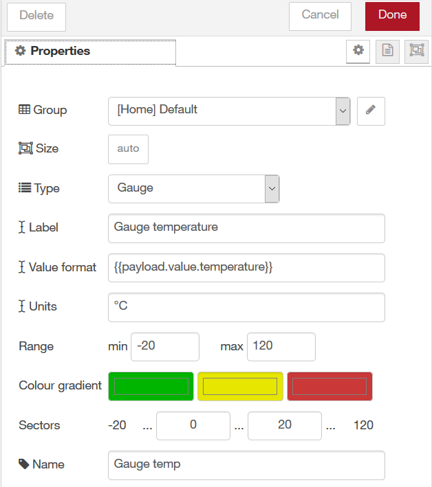

On Windows launch CMD.exe as an administrator to launch Note-RED

```ruby
    node-red
```

You fill find Note-RED at : http://localhost:1880

And dashboards at : http://localhost:1880/ui

# Retrieve your data and display them in a dashboard #

## a) Configuration of MQTT node to retrieve data from your device though Live Objects ##


	1. select MQTT in node list (input section) 
	2. drag and drop it on node-red flow page
	3. double click on the node 
	4. click on the pen to add new mqtt-broker


	5. configure your Live Objects MQTT connection 


Field | Please enter 
------------ | -------------
Server | liveobjects.orange-business.com
Port | 1883
Client ID | urn:lo:nsid:whatyouwant whatyouwant will be the name of your application in "devices" list

	6. click on Security tab


Field | Please enter 
------------ | -------------
Username | payload+bridge
Password | complete with your own APIKey with XXX roles
	
	7. click on Add
	8. fill the topic 
	


Field | Please enter 
------------ | -------------
Topic | router/~event/v1/data/new/# to retrieve all data from all devices

	9. finally you have 


## b) convert your payload from json format to javascript ##

	1. select json node in function section
	2. drag and drop it on node-red flow page
	3. double click on the json node 
	3. Select "Always convert to JavaScript Object" and click on "Done"


	4. link json node with the previous one to get this


## c) configure your dashboard with widgets ##

First, note that on Live Objects MQTT format, you find measured values 

	+ for location in payload.location {lon, lat}
	+ for all other measured value in payload.value { ....}

**1) open the dashboard organization clicking on dashboard section on the right**
You can manage your tabs and groups
	- tabs are different pages of your dashboard
	- groups describe a tab organization. Each group is a column on the current tab. They are ordered from left to right

To display a widget on your dashboard , you must add that widget to a group.

**2) display a gauge**

Drag and drop node in dashboard section. Link it to the json node


Double click on Gauge node 
	1. select a group or click on the pen to create a group
	2. enter a label : it will be the name of the widget on dashboard
	3. in Value format enter the name of the field you want to display 
		- for instance {{payload.value.temperature}} 
	4. Units : the unit to display in the widget (free text)
	5. Name : the name of the widget to distinguish them in node red (free text)
then click on 


You get a flow like this : 


You can also organized several gauges to display different value like this :


c) display a chart with one or several values

Chart nodes can display X values corresponding to X coming values.


	* with this you display 2 different charts (one for temp , the second for hydro)


	* with that you display one chart with 2 lines 


Let's build the first option

Drag and drop node in function section. Link it to the json node

Double-click on function node 

	* enter a name "recup temp" in order to distinguish it in your flow
	* copy paste this code in function body , it will extract the data you want to display from the JSON payload to a simple string


var msgout ="";
msgout= msg.payload.value.temperature;
msg.payload=msgout;

msg.topic="Temp"; // mandatory for charts to display a label

return msg;


Drag and drop node in dashboard section. Link it to the previous function node.


Double click on chart node 

	* select a group or click on the pen to create a group
	* enter a label : it will be the name of the widget on dashboard
	* Name : the name of the widget to distinguish them in node red (free text)
	* be careful that your data will be between min and max of Y axis otherwise you would see no curve

then click on  


You get a flow like this : 


d) click on 

e) you can see your dashboard on http://localhost:1880/ui/  (ui in lower case)
