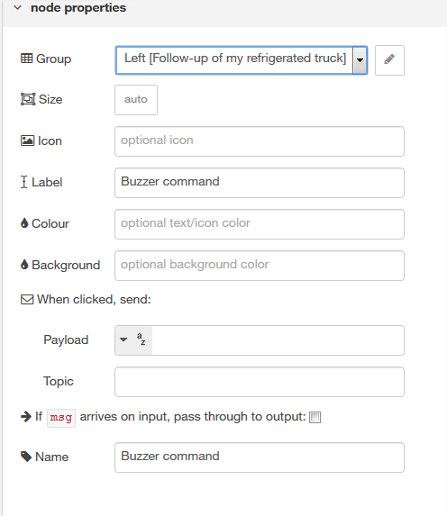

On Windows launch CMD.exe as an administrator to launch Note-RED

```ruby
    node-red
```

You fill find Note-RED at : http://localhost:1880

And dashboards at : http://localhost:1880/ui

# Send a command to your device from your dashboard #

Drag and drop button node in dashboard section.

Double click on button node 

	1. select a group or click on the pen to create a group
	2. enter a label : it will be the name of the widget on dashboard
	3. Name : the name of the widget to distinguish them in node red (free text)
then click on Done


