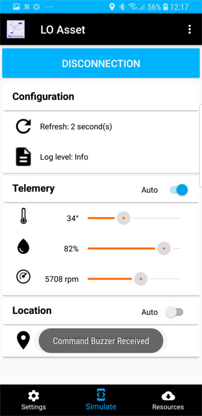

On Windows launch CMD.exe as an administrator to launch Note-RED

```ruby
    node-red
```

You fill find Note-RED at : http://localhost:1880

And dashboards at : http://localhost:1880/ui

# Send a command to your device from your dashboard #

**1) create a button on dashboard**

Drag and drop button node in dashboard section.

Double click on button node 

	1. select a group or click on the pen to create a group
	2. enter a label : it will be the name of the widget on dashboard
	3. Name : the name of the widget to distinguish them in node red (free text)
then click on Done


**2) configure the API to send the command**

To send a command using REST you must
	
	* use "To send a command using REST you must" API. 
	* use an API key with DEVICE_W role at list
	* send your API key in header of REST call
	* for MQTT device get URN of your device 
		* you can find them in Live Objects in "Devices" or "Parc" tab
		* it begins by urn:lo:nsid:
	* send your command in json format

so you will use an URL like this one
	```ruby
	https://liveobjects.orange-business.com/api/v1/deviceMgt/devices/urn%3Alo%3Ansid%3Aandroid%3A359041083857129PRIMARY/commands
	```
	where you have :
		* urn : urn:lo:nsid:android:359041083857129PRIMARY
		
**3) configure payload and headers**
Drag and drop function node in function section.

Double click on function node 

	1. Name : the name of the widget to distinguish them in node red (free text) 
	2. in Function 
		a) use msg.payload to enter the command to send to the device
		b) use msg.header to enter mandatory headers
			* X-API-KEY : to enter your api key 
			* Accept : to send application/json
		c) enter the following code

```ruby
msg.payload = '{ "request": { "connector": "mqtt", "value": { "req": "buzzer" }}}';
msg.headers = {};
// -------
// remplace by your API-Key with DEVICE_W role
msg.headers["X-API-KEY"] = 'xxxxxxx';
// -------
msg.headers["Accept"] = 'application/json';
return msg;
```	
	
	


	3. link function node with the previous one to get this


**4) convert to json format**	

Drag and drop json node in function section.

Link it to the previous one to get this :


**5) send REST API request to Live Objects**	

Drag and drop http request node in function section.

	1. Method : select POST method
	2. URL : enter the URL explained in section 2 below it will look like 
	
```ruby
https://liveobjects.orange-business.com/api/v1/deviceMgt/devices/urn%3Alo%3Ansid%3Aandroid%3A359041083857129PRIMARY/commands
```


Link it to the previous one to get this :


**6) Use it**

Click on the Buzzer command on the dashbord.

You will see a 'buzzer' pop-up on the Android phone 


