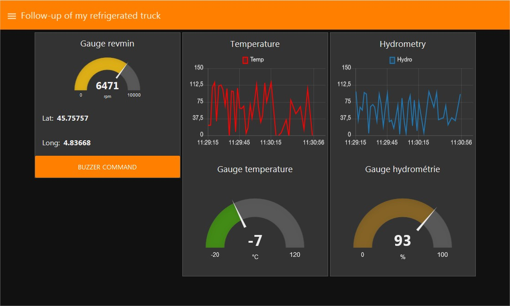

# Learn how to create Node-RED dashboards with Live Objects + a sample

Get your Live Objects account on https://liveobjects.orange-business.com/

Get that kind of dashboard 

You can simulate the object using our android demo <a href="https://play.google.com/store/apps/details?id=com.orange.lo.assetdemo">you can download here </a>

Do not forget to enter your API key in the android demo.

You can download the sample _exampleDashboard.json_ and import it in Node-RED. Do not forget to modify MQTT, the function node called "set payload and headers" and http request node with your own identifier.
